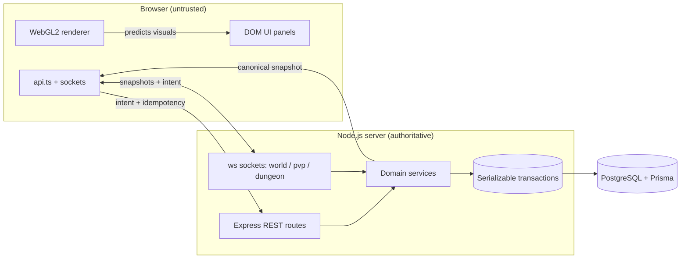
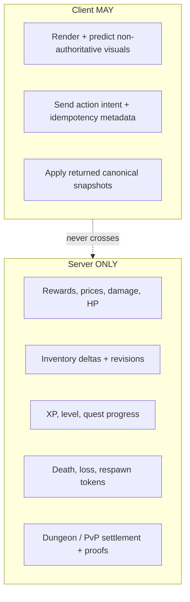
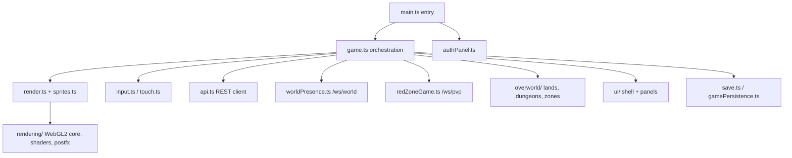
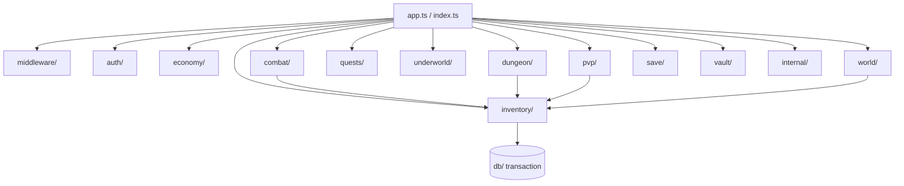
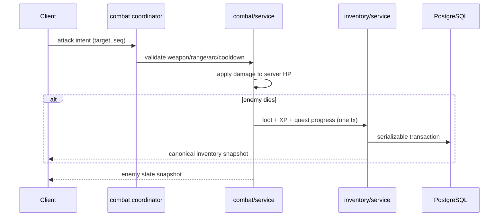

# UNDRAL Architecture

This document is the map of the codebase: how the pieces fit together, where
authority lives, and how the large files should be split into smaller ones.

For gameplay/domain detail see [`README.md`](README.md) and the `docs/` folder.
Every architectural rule here is enforced in spirit by `npm run check:authority`.

## 1. System overview

The browser is a **renderer and intent sender**. All persistent value —
inventory, prices, damage, progression, death outcomes, completion proof —
is decided by the backend and stored in PostgreSQL.

## 2. Authority boundary

The single rule the whole project is organized around:

Any unported value path must **fail closed** — there is no local reward
fallback "for offline mode". `check:authority` fails the build if a persistent
local reward or a direct client inventory increment is reintroduced.

## 3. Client module map

| Area | Files | Responsibility |
|---|---|---|
| Entry / boot | `main.ts` | Fonts, styles, auth check, launch flow |
| Orchestration | `game.ts` | Loop, intent submission, snapshot application |
| Rendering | `render.ts`, `sprites.ts`, `rendering/` | Scene draw, procedural art, WebGL2 pipeline |
| World (local) | `world.ts`, `config.ts`, `overworld/` | Deterministic generation + authored land data |
| Networking | `api.ts`, `worldPresence.ts`, `redZoneGame.ts` | REST + WebSocket clients |
| UI | `ui/`, `authPanel.ts`, `styles.css` | DOM panels over the canvas |
| Persistence | `save.ts`, `gamePersistence.ts`, `serverInventory.ts` | Cloud-save cache + canonical snapshots |
| Input | `input.ts`, `touch.ts`, `fullscreen.ts` | Keyboard, touch, fullscreen |

## 4. Server domain map

Every persistent inventory mutation flows through `inventory/service.ts`.
Direct `InventoryStack` writes outside migration/test utilities are forbidden.

## 5. Example data flow — an overworld kill

## 6. Where the big files should be split

Four files carry most of the line count. They are cohesive today but are the
top refactor targets. Suggested splits (behavior-preserving):

| File | Lines | Suggested split |
|---|---|---|
| `src/game.ts` | ~2.4k | `game/loop.ts`, `game/intent.ts`, `game/snapshot.ts`, `game/session.ts` (overworld vs dungeon vs pvp) |
| `src/sprites.ts` | 10 | **Completed:** thin barrel re-exporting `sprites/core`, `actors`, `props`, `nature`, `structures`, `resources`, and `tiles` |
| `src/render.ts` | ~2.0k | `render/ground.ts`, `render/props.ts`, `render/entities.ts`, `render/hudOverlay.ts`, `render/minimap.ts` |
| `src/styles.css` | 9 | **Completed:** thin ordered `@import` entrypoint for the split `styles/` modules |
| `server/src/dungeon/service.ts` | ~1.2k | `dungeon/run.ts`, `dungeon/floor.ts`, `dungeon/rewards.ts`, `dungeon/settlement.ts` |

Sprite and stylesheet splits are complete. The remaining large orchestrators are
still intentionally deferred until their gameplay surfaces settle; each has a
clear owner, and behavior-preserving extraction remains the next maintainability
phase.

## 7. Per-section documentation

Each major folder carries its own `README.md`:

- Client: `src/README.md`, `src/overworld/README.md`, `src/rendering/README.md`, `src/ui/README.md`
- Server: `server/src/README.md` and one per domain (`auth/`, `combat/`, `dungeon/`, `economy/`, `inventory/`, `pvp/`, `quests/`, `save/`, `underworld/`, `vault/`, `world/`, `ws/`, `middleware/`, `internal/`, `db/`)

See also [`docs/PROJECT_ISSUES.md`](docs/PROJECT_ISSUES.md) for the open problem
list and [`docs/ROADMAP.md`](docs/ROADMAP.md) for planned features.
